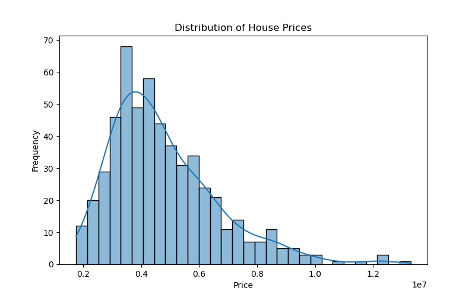
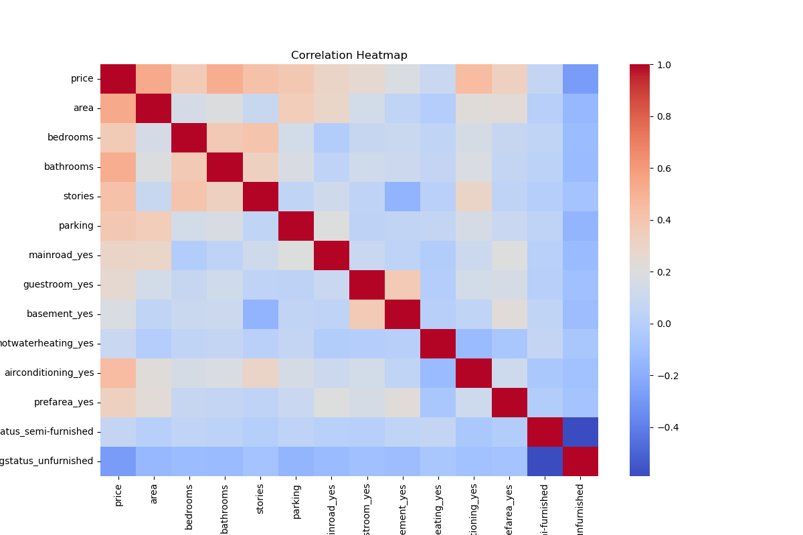
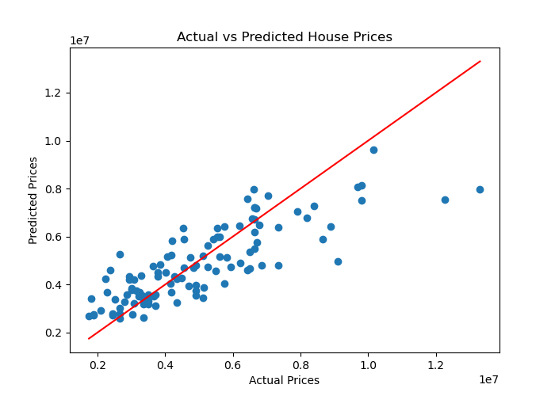
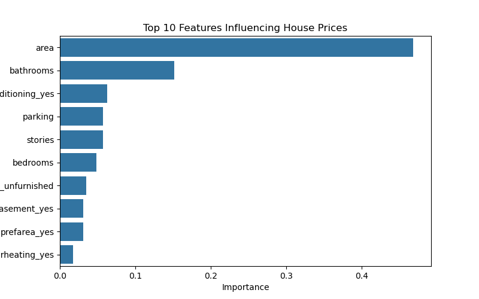

# 🏠 House Price Prediction using Machine Learning

## Overview

This project aims to predict house prices using machine learning techniques based on various property characteristics such as area, number of bedrooms, bathrooms, parking availability, furnishing status, and other amenities.

The project was completed as part of the **XYLOFY AI Data Science Internship – Week 1 Project**.

---

## Problem Statement

Real estate buyers and sellers often rely on guesswork or outdated comparisons to estimate a property's fair value. The objective of this project is to build regression models that can predict house prices and identify the features that most strongly influence property value.

---

## Dataset

* **Source:** Kaggle Housing Prices Dataset
* **Records:** 545 houses
* **Target Variable:** `price`

### Features Included

* Area
* Bedrooms
* Bathrooms
* Stories
* Parking
* Main Road Access
* Guest Room
* Basement
* Hot Water Heating
* Air Conditioning
* Preferred Area
* Furnishing Status

---

## Technologies Used

* Python
* Pandas
* NumPy
* Matplotlib
* Seaborn
* Scikit-learn
* Jupyter Notebook

---

## Project Workflow

### 1. Data Exploration

* Loaded dataset using Pandas
* Examined dataset structure and dimensions
* Identified target and feature variables
* Checked for missing values and duplicates

### 2. Data Cleaning

* Removed duplicate records
* Converted categorical variables using One-Hot Encoding
* Prepared data for machine learning models

### 3. Model Building

Two regression models were trained and evaluated:

* Linear Regression
* Random Forest Regressor

### 4. Model Evaluation

Evaluation metrics used:

* Mean Absolute Error (MAE)
* Root Mean Squared Error (RMSE)
* R² Score

---

## Results

## Results

| Model | MAE | RMSE | R² Score |
|--------|--------:|--------:|--------:|
| Linear Regression | 9.700434e+05 | 1.324507e+06 | 0.652924 |
| Random Forest Regressor | 1.021546e+06 | 1.400566e+06 | 0.611919 |

### Model Comparison

Linear Regression achieved the best performance with the highest R² score (0.653) and the lowest prediction error values. Therefore, it was selected as the final model for this project.

### Best Performing Model

**Linear Regression** achieved the highest R² score and the lowest prediction error, making it the preferred model for this dataset.

---

## Visualizations

### 1. House Price Distribution

This histogram shows the distribution of house prices in the dataset. Most houses fall within the lower to middle price range, while a smaller number of properties have significantly higher prices.

---

### 2. Correlation Heatmap

The correlation heatmap illustrates the relationships between different housing features and the target variable. Features with stronger positive correlations tend to have a greater impact on house prices.

---

### 3. Actual vs Predicted House Prices

This scatter plot compares the actual house prices with the values predicted by the Linear Regression model. The red diagonal line represents perfect predictions, while points closer to the line indicate better model performance.

---

### 4. Feature Importance Analysis

Feature importance analysis highlights the variables that contribute the most to house price prediction. Area was found to be the most influential feature, followed by bathrooms, air conditioning, parking availability, and number of stories.

---

## Key Findings

* **Area** was the most significant factor influencing house prices.
* **Bathrooms** were the second most important feature.
* Air conditioning, parking availability, and number of stories also contributed to house value.
* The model explained approximately **65% of the variation** in house prices.
* Larger houses generally commanded significantly higher prices.

---

## Business Recommendation

Real estate businesses should prioritize property size and essential amenities when estimating property values, setting prices, and designing marketing strategies.

---

## Future Improvements

* Hyperparameter tuning for improved accuracy
* Testing advanced regression models such as XGBoost
* Deploying the model using Streamlit
* Using larger and more diverse housing datasets

---

## Author

**Indrayani Prashant Mude**
St. Vincent Pallotti College of Engineering and Technology, Nagpur

Data Science Internship Project – XYLOFY AI
